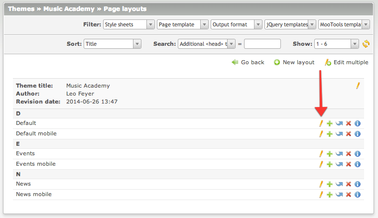
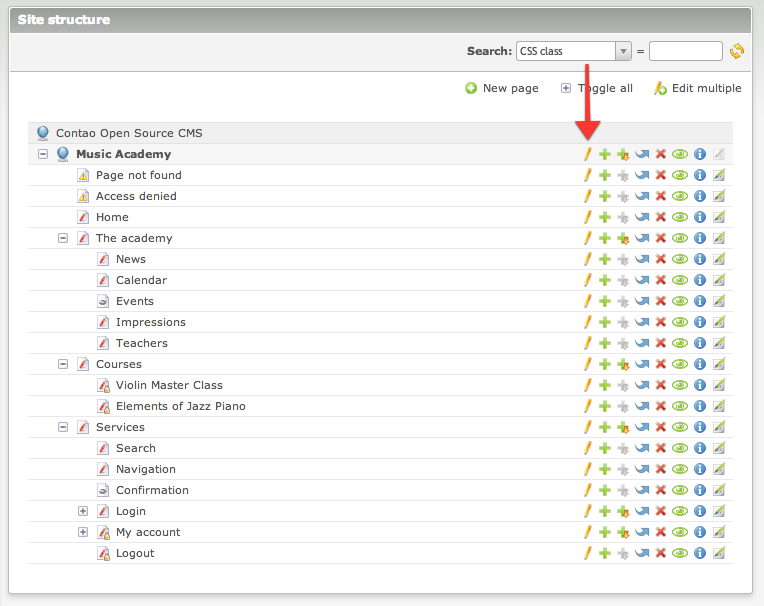

# Social Images – Documentation

## Configuration

The extension is activated in the page layout settings in the `Social images` section. You can also limit the number of 
images that will be used as well as the minimum width and height of an image. Usually, the social networks like Facebook 
and Google+ require at least 200x200px images.



## Website image

You can set a default image for the whole website that will be used in the first place. 
This is useful when you would like to use company logo for example. To enable it, browse to the `Site structure` and edit 
the root page settings. Then simply choose the image in the `Social images` section.



## How does it work?

Collected images are inserted in the `<head>` section according to the [Open Graph protocol](http://ogp.me):

```html
<meta property="og:image" content="http://example.com/files/music_academy/image.png">
<meta property="og:image" content="http://example.com/files/music_academy/james-wilson.jpg">
<meta property="og:image" content="http://example.com/files/music_academy/layout.gif">
```
