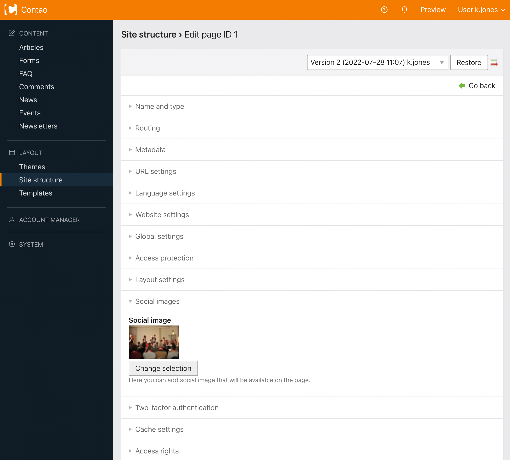

# Social Images – Documentation

## Configuration

The extension is activated in the page layout settings in the `Social images` section. You can also limit the number of
images used and an image's minimum width and height. Usually, social networks like Facebook require at least 200x200px images.


## Website image

You can set a default image for the whole website that will be used in the first place. This is useful for using
the company logo, for example. To enable it, go to the `Site structure` and edit the root page settings. Then simply
choose the image in the `Social images` section.



## How does it work?

Collected images are inserted in the `<head>` section according to the [Open Graph protocol](https://ogp.me):

```html
<meta property="og:image" content="http://social-images/assets/images/7/DSC_5276-6c9ba384.jpg">
<meta property="og:image:width" content="640">
<meta property="og:image:height" content="480">
<meta property="og:image" content="http://social-images/assets/images/a/slider_big-c-86a5d04d.png">
<meta property="og:image:width" content="394">
<meta property="og:image:height" content="296">
```

## Supported contexts

The extension currently supports the following contexts:

- Pages
- Events
- News articles
- Content elements:
  - Text
  - Gallery
  - Image
  - Player
  - YouTube
  - Vimeo

## Developers

If you would like to add images from your custom source to the page, you can use the image collector service:

```php
$this->imageCollector->addFromUuid($uuid); // from binary/string UUID (e.g. c67514ce-d9c8-11e3-8217-000c29e44aea)
$this->imageCollector->addFromPath($path); // from relative path (e.g. files/path/to/image.png)
```
